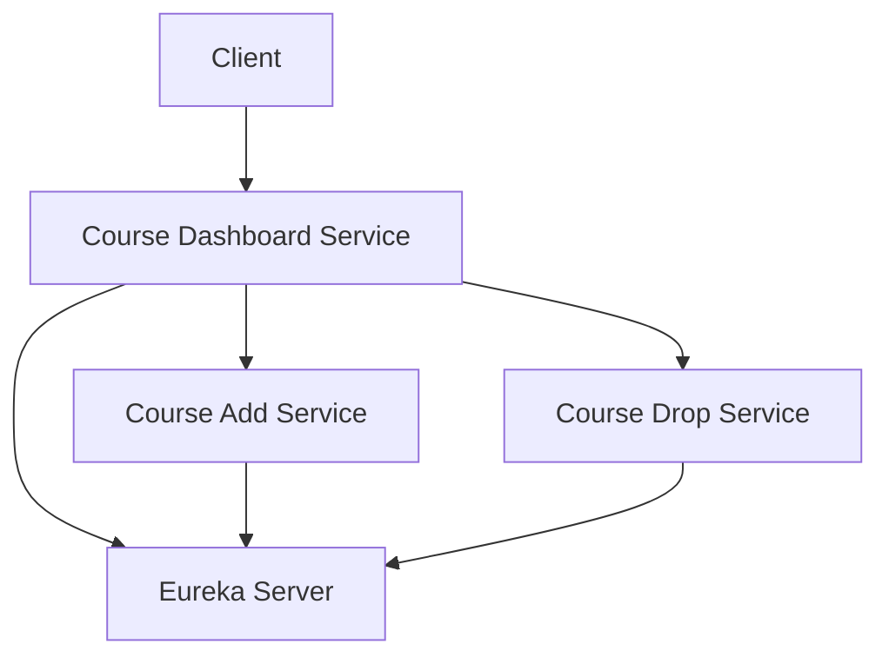

# Course Management System - Complete Guide

## Table of Contents

1. [Overview](#overview)
2. [System Architecture](#system-architecture)
3. [Technology Stack](#technology-stack)
4. [Prerequisites](#prerequisites)
5. [Setup Instructions](#setup-instructions)
6. [Running the Services](#running-the-services)
7. [API Endpoints](#api-endpoints)
8. [Example Requests and Outputs](#example-requests-and-outputs)
9. [Circuit Breaker Implementation](#circuit-breaker-implementation)
10. [Database Design](#database-design)
11. [Service Communication](#service-communication)
12. [Troubleshooting](#troubleshooting)

## Overview

This is a Spring Boot microservices application for managing courses with add, drop, and dashboard functionalities. The system allows students to:

- View available courses
- Add courses to their schedule
- Drop courses from their schedule
- View a dashboard with course information and credit calculations

## System Architecture



### Key Components:

1. **Eureka Server**: Service discovery component that allows microservices to find and communicate with each other
2. **Course Common Module**: Shared library containing common entities and DTOs
3. **Course Add Service**: Manages adding new courses and listing available courses
4. **Course Drop Service**: Manages dropping courses and listing opted courses
5. **Course Dashboard Service**: Central service that aggregates information from other services and provides the main user interface

## Technology Stack

- **Java**: 11+
- **Framework**: Spring Boot 2.7.0
- **Service Discovery**: Eureka Server
- **Service Communication**: Feign Clients
- **Circuit Breaker**: Resilience4J
- **Database**: H2 In-Memory Database
- **Build Tool**: Maven

## Prerequisites

- Java 11 or higher
- Maven 3.6 or higher

Note: Java 8 is not supported due to class version compatibility issues.

## Setup Instructions

1. **Verify Java Version**:

   ```bash
   java -version
   ```

   Ensure you're using Java 11+. If not, set JAVA_HOME to point to Java 11:

   ```bash
   export JAVA_HOME=/Library/Java/JavaVirtualMachines/temurin-11.jdk/Contents/Home
   ```

2. **Build the Project**:
   ```bash
   mvn clean package
   ```

## Running the Services

### Method 1: Manual Start (Recommended)

Start each service in a separate terminal:

1. **Eureka Server**:

   ```bash
   java -jar eureka-server/target/eureka-server-0.0.1-SNAPSHOT.jar
   ```

2. **Course Add Service**:

   ```bash
   java -jar course-add-service/target/course-add-service-0.0.1-SNAPSHOT.jar
   ```

3. **Course Drop Service**:

   ```bash
   java -jar course-drop-service/target/course-drop-service-0.0.1-SNAPSHOT.jar
   ```

4. **Course Dashboard Service**:
   ```bash
   java -jar course-dashboard-service/target/course-dashboard-service-0.0.1-SNAPSHOT.jar
   ```

### Method 2: Using Provided Scripts

1. **Start all services**:

   ```bash
   ./run-all-services.sh
   ```

2. **Check service status**:

   ```bash
   ./check-status.sh
   ```

3. **Stop all services**:
   ```bash
   ./stop-all-services.sh
   ```

## API Endpoints

### Course Add Service (Port: 8081)

- `POST /api/courses/add` - Add a new course
- `GET /api/courses/available` - Get available courses

### Course Drop Service (Port: 8082)

- `POST /api/courses/drop/{id}` - Drop a course by ID
- `GET /api/courses/opted` - Get opted courses

### Course Dashboard Service (Port: 8083)

- `GET /api/dashboard/summary` - Get dashboard summary
- `POST /api/dashboard/courses/add/{id}` - Add a course through dashboard
- `POST /api/dashboard/courses/drop/{id}` - Drop a course through dashboard

### Eureka Server (Port: 8761)

- `/` - Eureka dashboard

## Example Requests and Outputs

### 1. Get Dashboard Summary

```bash
curl http://localhost:8083/api/dashboard/summary
```

Sample Output:

```json
{
  "availableCourses": [
    {
      "id": null,
      "name": "Chemistry",
      "credits": 3,
      "optedIn": false
    },
    {
      "id": null,
      "name": "Biology",
      "credits": 4,
      "optedIn": false
    }
  ],
  "optedCourses": [
    {
      "id": null,
      "name": "Mathematics",
      "credits": 3,
      "optedIn": true
    },
    {
      "id": null,
      "name": "Physics",
      "credits": 4,
      "optedIn": true
    }
  ],
  "totalCredits": 7
}
```

### 2. Add a Course

```bash
curl -X POST http://localhost:8083/api/dashboard/courses/add/1
```

Sample Output:

```
Course added successfully
```

### 3. Drop a Course

```bash
curl -X POST http://localhost:8083/api/dashboard/courses/drop/1
```

Sample Output:

```
Course dropped successfully
```

### 4. Get Available Courses

```bash
curl http://localhost:8081/api/courses/available
```

Sample Output:

```json
[
  {
    "id": 3,
    "name": "Chemistry",
    "credits": 3,
    "optedIn": false
  },
  {
    "id": 4,
    "name": "Biology",
    "credits": 4,
    "optedIn": false
  }
]
```

### 5. Get Opted Courses

```bash
curl http://localhost:8082/api/courses/opted
```

Sample Output:

```json
[
  {
    "id": 1,
    "name": "Mathematics",
    "credits": 3,
    "optedIn": true
  },
  {
    "id": 2,
    "name": "Physics",
    "credits": 4,
    "optedIn": true
  }
]
```

## Circuit Breaker Implementation

The system uses Resilience4J for circuit breaker implementation to ensure service resilience:

### 1. Feign Clients with Circuit Breaker

**CourseAddClient.java:**

```java
@FeignClient(name = "course-add-service")
@CircuitBreaker(name = "courseAddClient", fallbackMethod = "getDefaultAvailableCourses")
public interface CourseAddClient {

    @GetMapping("/api/courses/available")
    List<Course> getAvailableCourses();

    default List<Course> getDefaultAvailableCourses(Exception ex) {
        return List.of();
    }
}
```

**CourseDropClient.java:**

```java
@FeignClient(name = "course-drop-service")
@CircuitBreaker(name = "courseDropClient", fallbackMethod = "getDefaultOptedCourses")
public interface CourseDropClient {

    @GetMapping("/api/courses/opted")
    List<Course> getOptedCourses();

    @PostMapping("/api/courses/drop/{id}")
    String dropCourse(@PathVariable Long id);

    default List<Course> getDefaultOptedCourses(Exception ex) {
        return List.of();
    }

    default String getDefaultDropCourse(Long id, Exception ex) {
        return "Service unavailable";
    }
}
```

### 2. Service Layer with Circuit Breaker

**DashboardService.java:**

```java
@Service
@CircuitBreaker(name = "dashboardService")
public class DashboardService {
    // ...
}
```

### 3. Configuration

In `application.properties`:

```properties
feign.circuitbreaker.enabled=true
```

### How It Works

1. When the dashboard service calls the add or drop services via Feign clients, it uses the circuit breaker pattern
2. If a service is unavailable or responds with an error, the circuit breaker opens
3. When the circuit is open, fallback methods are called instead of making actual service calls
4. This prevents cascading failures and provides graceful degradation
5. After a timeout period, the circuit breaker attempts to close and test the service again

## Database Design

Each microservice uses an in-memory H2 database for simplicity:

### Course Table

| Column Name | Type    | Description                              |
| ----------- | ------- | ---------------------------------------- |
| id          | BIGINT  | Primary key, auto-generated              |
| name        | VARCHAR | Course name                              |
| credits     | INTEGER | Credit value of the course               |
| opted_in    | BOOLEAN | Whether the course is currently opted in |

## Service Communication

### 1. Service Discovery with Eureka

All services register themselves with the Eureka server on startup. This allows services to discover and communicate with each other without hardcoding URLs.

### 2. Feign Clients

The dashboard service uses Feign clients to communicate with the add and drop services:

```java
@FeignClient(name = "course-add-service")
public interface CourseAddClient {
    @GetMapping("/api/courses/available")
    List<Course> getAvailableCourses();
}
```

### 3. Load Balancing

Spring Cloud LoadBalancer automatically distributes requests among multiple instances of a service if they exist.

## Troubleshooting

### 1. Java Version Issues

**Problem**: `UnsupportedClassVersionError` when starting services
**Solution**: Ensure you're using Java 11+:

```bash
export JAVA_HOME=/Library/Java/JavaVirtualMachines/temurin-11.jdk/Contents/Home
```

### 2. Services Not Starting

**Problem**: Services fail to start with circuit breaker errors
**Solution**: Remove `@EnableCircuitBreaker` annotation from main application classes as it's deprecated.

### 3. Connection Refused Errors

**Problem**: `curl: (7) Failed to connect to localhost port 8083`
**Solution**: Ensure all services are running:

```bash
./check-status.sh
```

### 4. Services Not Appearing in Eureka

**Problem**: Services not showing in Eureka dashboard
**Solution**: Check that:

1. Eureka server is running on port 8761
2. Services have correct Eureka configuration in `application.properties`
3. Network connectivity between services and Eureka server

### 5. Empty Responses from APIs

**Problem**: APIs return empty lists or default values
**Solution**: This may be due to the circuit breaker being open. Wait for the timeout period or restart the services.
