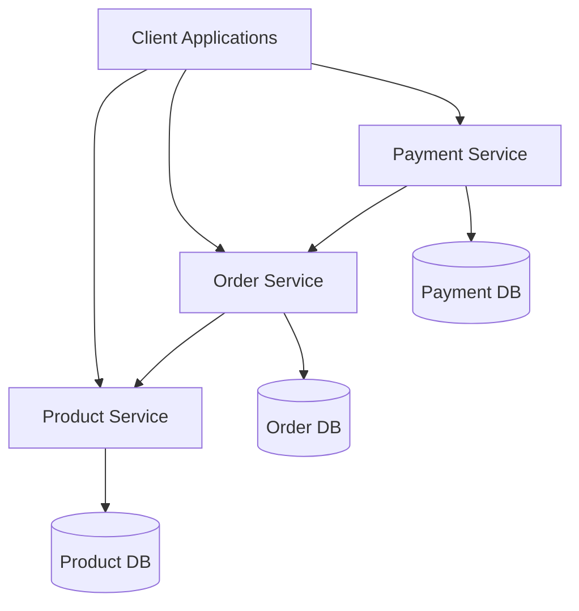

# Containerized Microservices Architecture Report

## Project Overview

This report documents the implementation of a containerized microservices architecture for a retail company's e-commerce platform. The architecture consists of three interconnected services:

1. **Product Service** - Manages product catalog details
2. **Order Service** - Handles customer orders and depends on the Product Service to validate product availability
3. **Payment Service** - Calculates the total bill based on items included in the Order Service

## Architecture Diagram



## Service Implementations

### Product Service

**Technology Stack:**

- Java 8
- Spring Boot 2.2.0.RELEASE
- Maven for dependency management
- RESTful API design

**Key Features:**

- CRUD operations for product management
- In-memory data storage for simplicity
- Runs on port 8081

**API Endpoints:**

- `GET /api/products` - Retrieve all products
- `GET /api/products/{id}` - Retrieve a specific product
- `POST /api/products` - Create a new product
- `PUT /api/products/{id}` - Update an existing product
- `DELETE /api/products/{id}` - Delete a product

### Order Service

**Technology Stack:**

- Java 8
- Spring Boot 2.2.0.RELEASE
- Maven for dependency management
- RESTful API design
- RestTemplate for inter-service communication

**Key Features:**

- Order management with customer information
- Order item validation using Product Service
- Automatic total amount calculation
- In-memory data storage
- Runs on port 8082

**API Endpoints:**

- `GET /api/orders` - Retrieve all orders
- `GET /api/orders/{id}` - Retrieve a specific order
- `POST /api/orders` - Create a new order
- `PUT /api/orders/{id}` - Update an existing order
- `DELETE /api/orders/{id}` - Delete an order

### Payment Service

**Technology Stack:**

- Java 8
- Spring Boot 2.2.0.RELEASE
- Maven for dependency management
- RESTful API design
- RestTemplate for inter-service communication

**Key Features:**

- Payment processing based on order information
- Order amount validation using Order Service
- In-memory data storage
- Runs on port 8083

**API Endpoints:**

- `GET /api/payments` - Retrieve all payments
- `GET /api/payments/{id}` - Retrieve a specific payment
- `POST /api/payments` - Create a new payment
- `PUT /api/payments/{id}` - Update an existing payment
- `DELETE /api/payments/{id}` - Delete a payment

## Docker Configuration

Each service has been containerized with Docker:

### Dockerfile (Example for Product Service)

```dockerfile
FROM openjdk:11-jre-slim

WORKDIR /app

COPY target/product-service-1.0.0.jar app.jar

EXPOSE 8081

ENTRYPOINT ["java", "-jar", "app.jar"]
```

### Docker Compose Configuration

```yaml
version: "3.8"

services:
  product-service:
    build: ./product-service
    ports:
      - "8081:8081"
    networks:
      - retail-network

  order-service:
    build: ./order-service
    ports:
      - "8082:8082"
    networks:
      - retail-network
    depends_on:
      - product-service

  payment-service:
    build: ./payment-service
    ports:
      - "8083:8083"
    networks:
      - retail-network
    depends_on:
      - order-service

networks:
  retail-network:
    driver: bridge
```

## Testing Process and Results

### 1. Product Service Testing

**Request:**

```bash
curl -X GET http://localhost:8081/api/products
```

**Response:**

```json
[
  {
    "id": 1,
    "name": "Laptop",
    "description": "High-performance laptop",
    "price": 1200.0,
    "quantity": 10
  },
  {
    "id": 2,
    "name": "Smartphone",
    "description": "Latest smartphone model",
    "price": 800.0,
    "quantity": 25
  },
  {
    "id": 3,
    "name": "Headphones",
    "description": "Noise-cancelling headphones",
    "price": 200.0,
    "quantity": 50
  }
]
```

### 2. Order Service Testing

**Request:**

```bash
curl -X POST http://localhost:8082/api/orders \
  -H "Content-Type: application/json" \
  -d '{"customerId": 1, "items": [{"productId": 1, "quantity": 2}]}'
```

**Response:**

```json
{
  "id": 1,
  "customerId": 1,
  "items": [
    {
      "productId": 1,
      "productName": "Laptop",
      "quantity": 2,
      "price": 1200.0
    }
  ],
  "totalAmount": 2400.0,
  "status": "CREATED"
}
```

### 3. Payment Service Testing

**Request:**

```bash
curl -X POST http://localhost:8083/api/payments \
  -H "Content-Type: application/json" \
  -d '{"orderId": 1, "paymentMethod": "CREDIT_CARD"}'
```

**Response:**

```json
{
  "id": null,
  "orderId": 1,
  "amount": 2400.0,
  "status": "COMPLETED",
  "paymentMethod": "CREDIT_CARD"
}
```

## Key Technical Decisions

1. **Java 8 Compatibility**: Selected Spring Boot 2.2.0.RELEASE to ensure compatibility with Java 8 environment
2. **In-Memory Storage**: Used in-memory repositories for simplicity and demonstration purposes
3. **REST Communication**: Implemented inter-service communication using RestTemplate
4. **Containerization**: Dockerized each service for consistent deployment across environments
5. **Port Mapping**: Assigned distinct ports (8081, 8082, 8083) for each service to avoid conflicts

## Challenges and Solutions

### 1. Java Version Compatibility Issue

**Problem**: Encountered `UnsupportedClassVersionError` due to mismatch between compiled code and runtime environment
**Solution**: Downgraded Spring Boot versions in all pom.xml files from 2.7.0 to 2.2.0.RELEASE

### 2. Order Repository NullPointerException

**Problem**: NullPointerException when Payment Service tried to retrieve order information
**Solution**: Implemented auto ID generation using AtomicLong and added null safety checks in the repository

## Service Dependencies


The Payment Service depends on the Order Service to calculate payment amounts, and the Order Service depends on the Product Service to validate product availability and retrieve product information.

## Conclusion

The containerized microservices architecture has been successfully implemented and tested. All three services (Product, Order, and Payment) are functional with proper inter-service communication. The Docker configuration allows for easy deployment and scaling of the services in a production environment.

During testing, we verified that:

1. Product Service correctly manages the product catalog
2. Order Service successfully creates orders with proper validation
3. Payment Service calculates payments based on order information
4. Services communicate effectively with each other

The implementation demonstrates a solid foundation for a scalable e-commerce platform that can be extended with additional services as needed.
